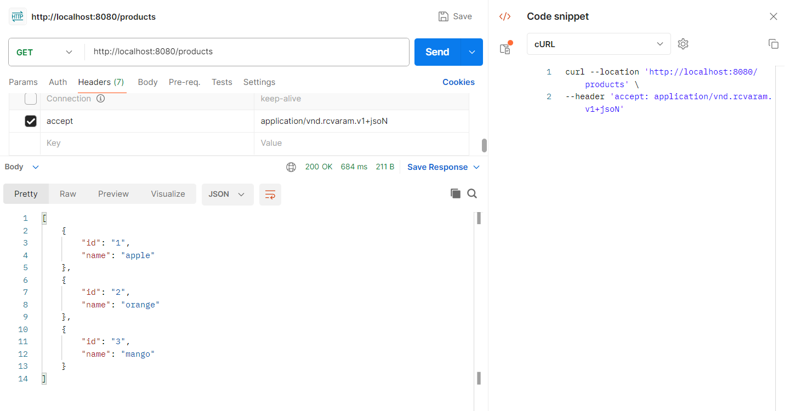
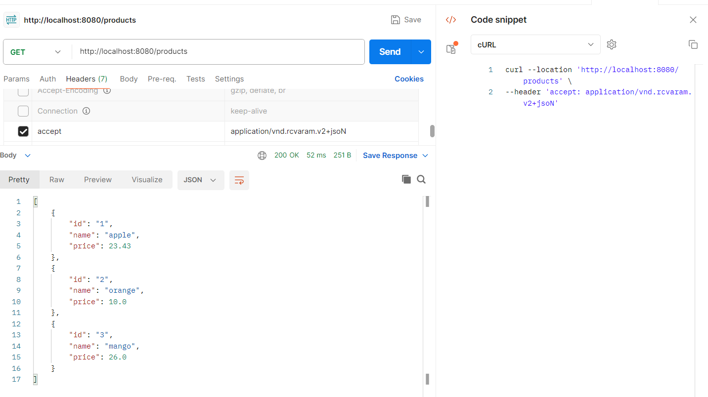
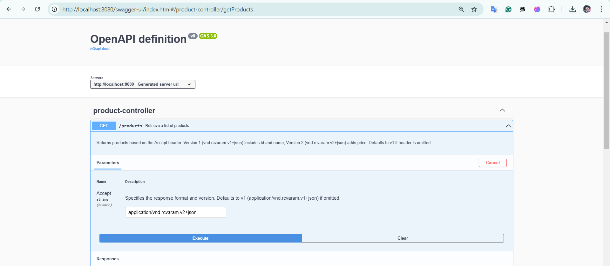
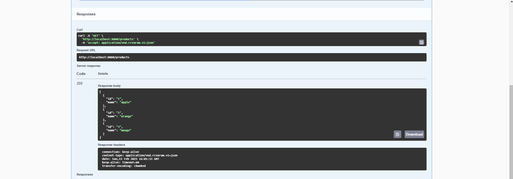
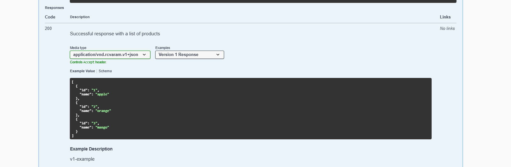
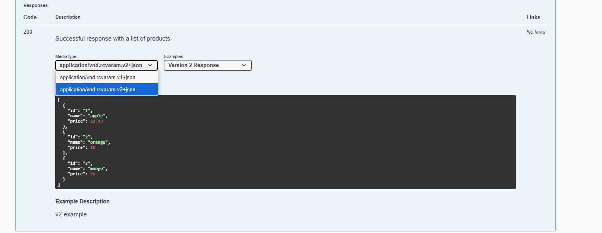
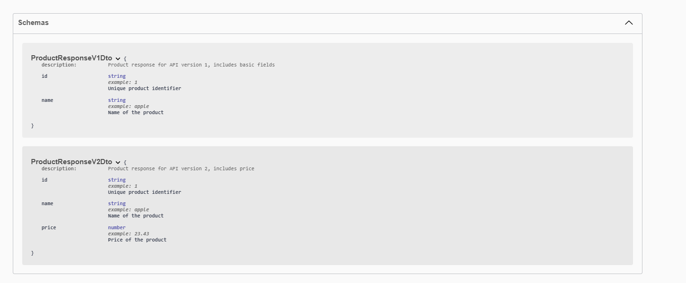

# medium-api-versioning
https://medium.com/javarevisited/stop-messing-up-your-api-versions-07a330aa9973

## For V1 Api

```
curl --location 'http://localhost:8080/products' \
--header 'accept: application/vnd.rcvaram.v1+jsoN'
```

## For V2 Api

```
curl --location 'http://localhost:8080/products' \
--header 'accept: application/vnd.rcvaram.v2+jsoN'
```

## Swagger API










